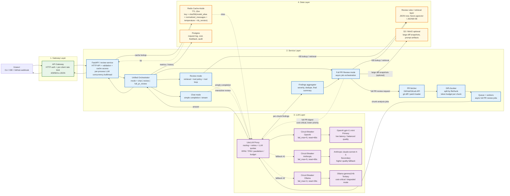

# Архитектурный паспорт PR Review Bot

Документ фиксирует целевую архитектуру дипломного PR Review Assistant и текущее состояние реализованного HTTP-ядра. Целевая схема развивается по Варианту 2: единый orchestrator с режимами `chat | review | full_pr_review`.

## Нагрузочный профиль и ограничения

| Метрика | Целевое значение |
| --- | --- |
| Сценарий | 1) chat, 2) interactive review Q&A, 3) full PR review с итоговым списком замечаний |
| Пиковая нагрузка | interactive: 30 RPM; full PR review: до 10 PR/час |
| Пиковый токен-поток | interactive: 90k TPM; full PR review: до 250k TPM на batch-контур |
| Средний вход | interactive: 1.5k-3k токенов; full PR review: 20k-120k токенов суммарно по чанкам diff |
| Средний ответ | interactive: 250-450 токенов; full PR review: 10-30 findings + summary |
| Целевой p95 | interactive: до 4 c для cache hit, до 8 c для cold path; full PR review: 30-120 c async SLA |
| Бюджет | до $3-5 в день |
| Целевой cache hit rate | 30-35% на повторяющихся review-вопросах |

## Поддерживаемые сценарии

### 1. Chat

Пользователь отправляет обычный вопрос без review-orchestration:

- короткий LLM-запрос;
- без retrieval;
- без server-side tools;
- с Redis cache-aside для повторяющихся запросов.

Этот режим нужен как самый простой и дешёвый путь для UI, smoke-check и интеграций.

### 2. Interactive Review

Пользователь задаёт точечный вопрос:

- почему ревьюер сделал замечание;
- какие правила применимы к этому куску diff;
- что проверить в импортах, idempotence, логировании и т.д.

Здесь главный приоритет — быстрый ответ, но уже с возможностью orchestration: retrieval по правилам ревью, ограниченные tools и policy-управление.

### 3. Full PR Review

Сервис получает целый PR и должен:

1. забрать metadata и diff из GitHub/GitLab или локального git;
2. разбить большой diff на чанки;
3. прогнать чанки через правила ревью и LLM;
4. собрать единый список замечаний, рисков и рекомендаций;
5. вернуть итоговый review-report.

Здесь приоритет уже другой: не мгновенный ответ, а полнота покрытия PR и контроль стоимости. Поэтому этот режим проектируется как асинхронный `queue-based` контур поверх той же LLM-инфраструктуры.

## Диаграмма компонентов



## Управление нагрузкой и квотами

В системе применяются три независимых механизма: HTTP rate limiting,
ограничение параллелизма LLM-вызовов и LLM-квоты. Они решают разные задачи и не
должны подменять друг друга.

| Механизм | Слой | Единица ограничения | Назначение | Реакция при превышении |
| --- | --- | --- | --- | --- |
| HTTP rate limit | FastAPI Redis limiter; в production также API Gateway / nginx | запросы клиента за интервал времени | защита HTTP-контура от злоупотребления и всплесков нагрузки | `429 Too Many Requests`, `Retry-After` |
| Concurrency bulkhead | FastAPI service | одновременно выполняемые LLM-вызовы | ограничение числа занятых соединений, корутин и запросов к downstream-сервисам | ожидание свободного слота; в целевой схеме — ограниченное ожидание и `503` при перегрузке |
| LLM quota | LiteLLM Proxy | RPM, TPM, число параллельных запросов, денежный бюджет | контроль пропускной способности LLM-слоя и стоимости использования провайдеров | ошибка превышения квоты; на внешней границе нормализуется в `429` |

### HTTP rate limit

HTTP rate limit в текущей реализации есть на уровне FastAPI: middleware считает
запросы к `/chat` и `/chat/stream` в Redis по `X-User-ID`, а если заголовка нет —
по IP-адресу клиента. Лимит задаётся переменной `RATE_LIMIT_PER_MIN`; при
превышении сервис возвращает `429 Too Many Requests` и `Retry-After: 60`.

Этот limiter нужен для локального стенда, учебных security-прогонов и базовой
защиты прямого доступа к FastAPI. Он не заменяет production ingress-policy:
перед публичным контуром должен стоять nginx/API Gateway, который применяет
лимиты до расходования ресурсов приложения и использует подтверждённый субъект
аутентификации: `user_id`, API key, tenant либо IP-адрес для
неаутентифицированного трафика.

В целевом развёртывании порт приложения должен быть доступен только из
внутренней сети gateway. Публикация порта `8000` в текущем `compose.yaml`
предназначена для локальной разработки и не является production-конфигурацией.

### Concurrency bulkhead в FastAPI

Параметр `LLM_MAX_CONCURRENCY` ограничивает количество одновременно выполняемых
LLM-вызовов посредством `asyncio.Semaphore`. Это ограничение защищает ресурсы
процесса приложения и downstream-соединения, но не задаёт число запросов в
минуту и не ограничивает стоимость.

Текущая реализация имеет следующие свойства:

- семафор общий для `/chat` и `/chat/stream` внутри одного процесса;
- cache hit в `/chat` не занимает LLM-слот;
- лимит действует отдельно в каждом worker-процессе и экземпляре приложения;
- при `W` workers и значении `C = LLM_MAX_CONCURRENCY` верхняя граница
  параллелизма одного экземпляра равна `W × C`;
- ожидающие запросы не отклоняются по таймауту очереди и могут накапливаться до
  завершения HTTP-запроса или срабатывания внешнего timeout.

Следовательно, `LLM_MAX_CONCURRENCY` является локальным bulkhead, а не
распределённой квотой. Для целевого production-развёртывания требуется
согласовать число workers, timeout gateway и предел параллелизма LiteLLM.

### LLM-квоты в LiteLLM

LiteLLM отвечает за ограничения, для которых требуется информация о модели,
токенах, ключе и стоимости:

- `rpm_limit` — запросы в минуту;
- `tpm_limit` — токены в минуту;
- `max_parallel_requests` — одновременные запросы;
- `max_budget` и `budget_duration` — денежный лимит и период его сброса.

Пользовательские, командные и key-level квоты задаются через virtual keys,
users или teams LiteLLM. Для их постоянного хранения и распределённого учёта
LiteLLM требует PostgreSQL.

Параметры `rpm` и `tpm` внутри `model_list[].litellm_params` имеют другое
назначение: они описывают пропускную способность конкретного deployment и
используются router-ом при выборе backend. В production-like конфигурации
приняты следующие начальные planning values:

| Deployment | RPM | TPM | Основание |
| --- | ---: | ---: | --- |
| OpenAI primary | 30 | 90 000 | целевой агрегированный interactive-профиль |
| Anthropic fallback | 20 | 60 000 | пропорционально сниженная резервная пропускная способность |
| Ollama degraded mode | 10 | 30 000 | ограниченная локальная пропускная способность |

Эти значения не являются пользовательскими квотами и не заменяют ограничения
провайдера. Перед production-развёртыванием они должны быть согласованы с
фактическими provider limits и подтверждены нагрузочным тестом. Наличие
`rpm: 30` и `tpm: 90000` в `config.production_like.yaml` не означает, что для
конкретного клиента настроены соответствующие лимиты.

### Текущее и целевое состояние

| Контроль | Текущее состояние | Целевое состояние |
| --- | --- | --- |
| HTTP rate limit | Redis-backed middleware в FastAPI для `/chat` и `/chat/stream`, лимит через `RATE_LIMIT_PER_MIN`; локальный порт `8000` открыт для разработки | nginx/API Gateway как внешний ingress-лимит по подтверждённому субъекту; FastAPI limiter остаётся внутренним safety net, прямой доступ к FastAPI закрыт |
| Service concurrency | `LLM_MAX_CONCURRENCY`, локальный семафор на процесс | сохраняется; параметры согласованы с workers и gateway timeout |
| Deployment capacity | `rpm`/`tpm` заданы как начальные planning values для backend-ов LiteLLM | значения согласованы с квотами провайдеров и результатами нагрузочного теста |
| LLM user quotas | virtual keys и постоянный учёт не настроены | LiteLLM virtual keys/teams с RPM, TPM, parallel limit и budget; PostgreSQL |
| Full PR review | отдельный batch-контур не реализован | очередь и ограниченное число workers с отдельным бюджетом и приоритетом |

Принцип конфигурации: gateway ограничивает публичный входящий HTTP-трафик,
FastAPI применяет локальный per-minute limiter и ограничивает конкуренцию за
ресурсы, LiteLLM ограничивает потребление LLM. Ответ `429` должен формироваться
слоем, квота которого была превышена; `503` используется для временной
недоступности или перегрузки сервиса, не связанной с квотой конкретного клиента.

## ADR-004: Управление нагрузкой и квотами

**Status:** Accepted (2026-06-18)

**Context.** Система обрабатывает интерактивные HTTP-запросы и в целевой
архитектуре должна выполнять ресурсоёмкий `full_pr_review`. Для этих потоков
требуются разные ограничения: защита публичного endpoint, ограничение локальных
ресурсов FastAPI, контроль токенов и стоимости LLM, а также изоляция
batch-нагрузки. Один универсальный limiter в приложении не покрывает все
перечисленные задачи и смешивает ответственности инфраструктурного,
транспортного и прикладного слоёв.

**Decision.**

1. HTTP rate limit в текущем сервисе реализуется в FastAPI middleware поверх
   Redis для `/chat` и `/chat/stream`. Идентификатором служит `X-User-ID`, а при
   его отсутствии IP-адрес клиента. Лимит задаётся `RATE_LIMIT_PER_MIN`.
2. В production внешний HTTP rate limit также реализуется в nginx/API Gateway
   как часть deployment-конфигурации. Gateway применяет лимит по
   аутентифицированному субъекту или, для неаутентифицированного трафика, по
   IP-адресу. Прямой внешний доступ к FastAPI в production запрещается сетевой
   политикой.
3. FastAPI сохраняет `LLM_MAX_CONCURRENCY` как локальный concurrency bulkhead.
4. В LiteLLM для каждого deployment задаются `rpm` и `tpm`, используемые
   router-ом при планировании нагрузки. Пользовательские RPM/TPM,
   `max_parallel_requests` и бюджеты вводятся через virtual keys или teams
   после подключения PostgreSQL.
5. `full_pr_review` выполняется отдельным worker pool и не использует
   интерактивный request-response контур. Начальная конфигурация worker pool:
   два worker-а, не более одного активного LLM-вызова на worker и суммарный
   batch concurrency, равный двум. Значение уточняется нагрузочным тестом.
6. Для batch-контура предусматриваются отдельные LiteLLM key/team, TPM-бюджет,
   денежный бюджет и приоритет ниже интерактивного трафика.

**Consequences.**

- FastAPI limiter даёт локальную защиту и воспроизводимый учебный контроль
  нагрузки, но не является распределённой production-квотой;
- gateway остаётся обязательным внешним enforcement layer для публичного
  развёртывания;
- HTTP-ограничение gateway не действует при его обходе, поэтому сетевое
  закрытие прямого доступа является обязательным условием
  production-развёртывания;
- `LLM_MAX_CONCURRENCY` остаётся локальным для процесса и должен рассчитываться
  совместно с количеством workers;
- полноценные пользовательские квоты LiteLLM требуют PostgreSQL и управления
  virtual keys;
- batch-нагрузка не должна занимать все интерактивные LLM-слоты.

**Alternatives considered.**

- Только app-level Redis limiter отклонён как production-политика: он не видит
  подтверждённый субъект так надёжно, как gateway, и действует отдельно в
  приложении. При этом локальный Redis limiter принят как safety net и
  проверяемый учебный контроль для `/chat`.
- Только nginx rate limit отклонён: gateway не контролирует фактическое число
  токенов, стоимость и provider-specific limits.
- Только LiteLLM quotas отклонены: они не защищают остальные HTTP endpoint-ы и
  ресурсы FastAPI до выполнения LLM-вызова.
- Общий worker pool для interactive и `full_pr_review` отклонён из-за риска
  starvation интерактивных запросов длинными batch-задачами.

## ADR-001: Выбор паттерна взаимодействия

**Status:** Accepted (2026-06-03)

**Context.** Проект поддерживает три режима. `chat` — простой completion/stream без orchestration. `review` — интерактивный PR-review ассистент: пользователь задаёт вопрос по diff или просит объяснить замечание, а сервис при необходимости использует retrieval по базе правил ревью и ограниченные tools. `full_pr_review` — полный просмотр PR: сервис забирает diff целиком, режет его на чанки, прогоняет через review pipeline и возвращает агрегированный список замечаний. Ожидаемая нагрузка: interactive — около 30 RPM и до 90k TPM; full PR review — до 10 PR/час с суммарным объёмом до 250k TPM на batch-контур. Ограничение по стоимости — до $3-5 в день, поэтому важны кеширование, лимиты на `max_tokens` и отдельная политика для тяжёлых задач.

**Decision.** Поверх HTTP API вводится **единый orchestrator с режимами `chat | review | full_pr_review`**. Режим `chat` идёт кратчайшим путём и использует только completion/stream + cache. Режим `review` остаётся **Request-Response**: gateway принимает запрос, orchestrator собирает контекст, при необходимости запускает retrieval и tool loop, затем возвращает готовый ответ. Для сценария `full_pr_review` orchestrator переключается в **Queue-based** контур: API принимает задачу, кладёт её в очередь, worker-ы анализируют diff по чанкам, а агрегатор собирает финальный review-report. Такой гибрид разделяет `latency-critical` и `cost-critical` нагрузку и не заставляет тяжёлый полный анализ блокировать интерактивные ответы.

**Consequences.** Для коротких `chat`-запросов сохраняется простая схема API и предсказуемая трассировка одного запроса. Для `review` появляется управляемая orchestration-логика без смешивания её с транспортным слоем. Для полного обзора PR сохраняется более тяжёлый async pipeline: нужен fetch diff, chunking, очередь, worker-ы, хранение статуса джобы и агрегатор результатов. Зато heavy review не душит основной сервис, а длинные PR можно обрабатывать с ограничением параллелизма и отдельным бюджетом.

**Alternatives considered.** **Streaming** отвергнут как основной паттерн: пользователь увидит токены раньше, но в интерактивном `review`-сценарии финальный текст часто появляется только после завершения retrieval/анализа контекста, а для `full_pr_review` streaming вообще не решает главную проблему длинной обработки. **Queue-based** отвергнут как единственный глобальный паттерн: polling/webhook completion избыточны для `chat` и короткого review-вопроса по PR. **Fan-out** отвергнут из-за лишней стоимости: параллельный запуск нескольких провайдеров ради каждого chunk review быстро съест бюджет.

## Unified Orchestrator

Вариант 2 вводит единый application-layer orchestrator, который управляет сценариями, а не перекладывает orchestration на `LLMService`.

Роли слоёв:

- `API layer` принимает HTTP, валидирует запрос, отдаёт SSE/JSON и управляет cache-aside.
- `Application layer` выбирает режим `chat | review | full_pr_review`, применяет policy, orchestrates retrieval/tools/queue.
- `Infrastructure layer` предоставляет OpenAI-compatible LLM gateway, Redis, LiteLLM, GitHub/GitLab adapters, queue и storage.

Режимы orchestrator:

- `chat`
  Простой путь: `messages -> LLM -> response`.
- `review`
  Interactive review: `messages -> retrieval -> tool policy -> tool loop -> LLM -> response`.
- `full_pr_review`
  Async pipeline: `PR fetch -> chunking -> queue/workers -> findings aggregation -> report`.

Ключевой принцип:

- `LLMService` не знает про tools, PR fetch, KB policy и review workflow.
- model может предложить `tool_calls`, но решение об исполнении принимает orchestrator.
- transport, orchestration и integrations разделены по слоям.

## Full PR Review Pipeline

Полный просмотр PR в целевой архитектуре работает так:

1. Клиент или webhook создаёт задачу `full_pr_review`.
2. `Gateway` принимает запрос и передаёт его в `Service`.
3. `Service` через `PR fetcher` забирает metadata PR, список файлов и unified diff.
4. `Diff chunker` делит PR по файлам и hunks так, чтобы не переполнить контекст модели.
5. Каждый chunk кладётся в очередь на анализ worker-ами.
6. Worker для каждого chunk:
   - находит релевантные правила из KB;
   - вызывает LLM через LiteLLM;
   - просит вернуть findings в структурированном виде: `severity`, `file`, `line`, `issue`, `recommendation`.
7. `Findings aggregator` удаляет дубли, объединяет похожие замечания и считает итоговую серьёзность.
8. Сервис собирает финальный report:
   - список замечаний;
   - общие риски;
   - рекомендации по исправлению;
   - короткий executive summary.

Ожидаемый результат такого режима — не чат-ответ, а полноценный review-отчёт по всему PR.

### Ограничение batch-контура

`full_pr_review` использует отдельную очередь и отдельный worker pool. Начальный
предел — два worker-а с одним активным LLM-вызовом на worker. Таким образом,
batch-контур создаёт не более двух одновременных LLM-вызовов независимо от
числа чанков в PR.

Worker pool должен использовать отдельный LiteLLM key/team со следующими
политиками:

- `max_parallel_requests = 2`;
- отдельный TPM-лимит, не превышающий целевые `250k TPM` batch-контура;
- отдельный дневной денежный бюджет;
- приоритет ниже интерактивных `chat` и `review` запросов;
- retry с exponential backoff и jitter без немедленного повторного fan-out.

Число worker-ов не масштабируется автоматически только по длине очереди.
Изменение concurrency допускается после проверки p95 интерактивного контура,
утилизации провайдерских квот и дневного бюджета.

Текущий `config.production_like.yaml` рассчитан на interactive-профиль до
`90k TPM` и не обеспечивает заявленные `250k TPM` batch-контура одновременно с
интерактивной нагрузкой. Перед реализацией `full_pr_review` требуется отдельная
LiteLLM deployment group для batch-задач либо увеличение подтверждённой
провайдерской квоты. До выполнения этого условия `250k TPM` является целевым
параметром проектирования, а не эксплуатационной гарантией.

## Формат итогового Full PR Review Report

Итог полного анализа PR должен возвращаться в структурированном виде, чтобы его можно было:

- показать человеку в UI;
- превратить в комментарии к PR;
- сохранить в БД;
- использовать для метрик и повторного анализа.

Рекомендуемый формат одной находки:

```json
{
  "severity": "high",
  "file": "app/services/llm.py",
  "line": 128,
  "category": "reliability",
  "issue": "Повторный сетевой вызов выполняется без явного timeout на уровне orchestration.",
  "recommendation": "Добавить timeout и обработку fallback-ветки, чтобы запрос не зависал на одном провайдере.",
  "source": "llm+retrieval"
}
```

Рекомендуемая структура полного отчёта:

```json
{
  "pr_id": 142,
  "summary": "Найдено 7 замечаний: 2 high, 3 medium, 2 low. Основные риски связаны с timeout, логированием и валидацией входных данных.",
  "overall_risk": "medium",
  "findings": [
    {
      "severity": "high",
      "file": "app/services/llm.py",
      "line": 128,
      "category": "reliability",
      "issue": "Повторный сетевой вызов выполняется без явного timeout на уровне orchestration.",
      "recommendation": "Добавить timeout и обработку fallback-ветки, чтобы запрос не зависал на одном провайдере.",
      "source": "llm+retrieval"
    },
    {
      "severity": "medium",
      "file": "app/routers/chat.py",
      "line": 44,
      "category": "maintainability",
      "issue": "Логика поиска смешана с форматированием ответа, из-за чего код сложнее тестировать.",
      "recommendation": "Разделить поиск и представление результата на отдельные функции.",
      "source": "llm"
    }
  ],
  "recommendations": [
    "Ввести единый timeout policy для всех LLM-вызовов.",
    "Добавить структурированные ошибки и метрики по fallback-переходам.",
    "Разделить тяжёлые batch-review и интерактивные запросы по отдельным очередям."
  ]
}
```

Минимальные поля, которые стоит требовать от каждого findings-объекта:

- `severity`
- `file`
- `line`
- `issue`
- `recommendation`

Если сервис публикует результат как PR-comment, то этот же отчёт можно рендерить в человекочитаемый вид:

1. Короткий summary по всему PR.
2. Список findings по убыванию серьёзности.
3. Для каждого findings: файл, строка, проблема, рекомендация.
4. В конце — 2-5 общих рекомендаций по всему PR.

## ADR-003: Формат результата Full PR Review

**Status:** Accepted (2026-06-03)

**Context.** Результат полного анализа PR нужен сразу в нескольких местах: в UI, в комментариях к pull request, в логах, в базе данных и в аналитике качества ревью. Если возвращать только свободный текст, его неудобно сортировать, дедуплицировать, фильтровать по `severity` и привязывать к конкретным файлам и строкам.

**Decision.** Формат результата для `full_pr_review` — **структурированный JSON-отчёт** с полями верхнего уровня `summary`, `overall_risk`, `findings`, `recommendations`, а для каждой находки — минимум `severity`, `file`, `line`, `issue`, `recommendation`. Человекочитаемый комментарий в PR считается производным представлением и рендерится из этого JSON, а не наоборот.

**Consequences.** Выигрыш: findings можно валидировать схемой, сохранять в Postgres, агрегировать по типам проблем, строить метрики и повторно рендерить в любой интерфейс. Усложнение: нужен строгий post-processing, контроль схемы и обработка случаев, когда LLM возвращает частично некорректированную структуру.

**Alternatives considered.** Свободный markdown-ответ отвергнут как основной формат: его удобно читать человеку, но неудобно автоматически анализировать и использовать для повторного рендеринга. Гибрид "сначала markdown, потом парсинг обратно в структуру" тоже отвергнут, потому что это хрупко и добавляет лишний этап преобразования.

## ADR-002: Стратегия fault tolerance для LLM-слоя

**Status:** Accepted (2026-06-03)

**Decision.** Primary-модель — `OpenAI gpt-4.1-mini`: это баланс качества, latency и цены для коротких review-ответов. Secondary fallback — `Anthropic claude-sonnet-4-5`: дороже, но полезен как качественный запасной вариант на отказах или деградации primary. Tertiary fallback — локальный `Ollama gemma3:4b`: нужен не ради качества, а ради доступности в режиме деградации и контроля бюджета. Переключение управляется через LiteLLM Proxy, а **Circuit Breaker ставится отдельно на каждого провайдера**. После серии ошибок провайдер уходит в cooldown, чтобы сервис не сжигал таймауты на заведомо больной upstream.

**Consequences.** Сервис переживает временный отказ одного облака без ручного переключения. При полном отказе облачных провайдеров остаётся ограниченный, но рабочий local-only режим через Ollama и FAQ/KB fallback. Дополнительная цена — необходимость поддерживать конфиг маршрутизации, наблюдаемость по каждому провайдеру и отдельные лимиты/таймауты.

**Alternative.** Писать собственный LLM gateway поверх отдельных SDK сейчас невыгодно: пришлось бы самостоятельно реализовать OpenAI-compatible surface, fallback ordering, retries, spend caps и нормализацию ошибок.

## Потенциальные точки отказа

| Слой | Если слой выпал | Что смягчает удар | Как деградирует сервис |
| --- | --- | --- | --- |
| Gateway | новые запросы не доходят до service | readiness probes, второй ingress, клиентские retry с jitter | вместо HTML 500 отдаётся структурированный `503` + `Retry-After`; GitHub webhook будет повторён отправителем |
| Service | недоступен orchestration, tool loop, prompt assembly | несколько replica, bulkhead на endpoint, короткие timeouts | gateway отвечает maintenance JSON; interactive review временно недоступен, а full PR jobs не принимаются или ставятся на паузу |
| LLM | primary или все провайдеры перестают отвечать | fallback chain, circuit breakers, cache hits, token caps | сначала переход на Anthropic, затем на Ollama; если лежат все — ответ по шаблону из FAQ/KB: «LLM временно недоступен, вот релевантные правила ревью» |
| Data | Redis/Postgres/S3 или KB-слой недоступны | local JSON KB, stateless mode, write-behind telemetry | interactive режим продолжает отвечать без кеша и без истории; full PR review может временно отключить сохранение промежуточных findings и работать только для небольших PR |

## Почему LiteLLM, а не свой gateway

Берём **LiteLLM Proxy** как готовый LLM Gateway:

- уже даёт OpenAI-совместимый API-слой для нескольких провайдеров;
- умеет routing, retries и ordered fallbacks из `config.yaml`;
- упрощает переход от текущего single-provider клиента к multi-provider схеме;
- уменьшает объём кода дипломного проекта: не нужно отдельно писать обвязку под OpenAI, Anthropic и локальный fallback.

Не пишем свой gateway на этом этапе, потому что это сразу добавляет большую невидимую работу: нормализацию ошибок, ключей, таймаутов, квот, логирования и spend tracking.

## LiteLLM: локальный разбор и demo-стенд

Артефакты:

- конфиг proxy: [docs/litellm/config.yaml](/workspaces/Review_bot/docs/litellm/config.yaml)
- production-like конфиг: [docs/litellm/config.production_like.yaml](/workspaces/Review_bot/docs/litellm/config.production_like.yaml)
- локальный fallback-стенд: [docs/litellm/mock_openai_server.py](/workspaces/Review_bot/docs/litellm/mock_openai_server.py)

Локальный demo-конфиг сделан так, чтобы без Docker проверить сам механизм fallback:

- `gpt-4.1-mini` -> `openai/gpt-4.1-mini` c намеренно неверным ключом;
- `gpt-4.1-mini-fallback` -> локальный OpenAI-compatible mock endpoint на `http://127.0.0.1:8001/v1`;
- в `router_settings.fallbacks` задан порядок `gpt-4.1-mini -> gpt-4.1-mini-fallback`.

Для защиты и обсуждения целевой архитектуры рядом лежит отдельный production-like конфиг:

- `gpt-4.1-mini` -> `openai/gpt-4.1-mini`
- `gpt-4.1-mini-fallback` -> `anthropic/claude-sonnet-4-5`
- `gpt-4.1-mini-local` -> `Ollama gemma3:4b`
- порядок failover: `OpenAI -> Anthropic -> Ollama`

Зачем два конфига:

- `config.yaml` нужен для локальной воспроизводимой демонстрации fallback даже без реальных облачных ключей;
- `config.production_like.yaml` показывает, как выглядит целевая схема с боевыми провайдерами из ADR.

Команды для воспроизведения:

```bash
python3 -m venv .venv-litellm
.venv-litellm/bin/pip install 'litellm[proxy]'
PRIMARY_OPENAI_API_KEY=bad-key \
FALLBACK_OPENAI_BASE_URL=http://127.0.0.1:8001/v1 \
FALLBACK_OPENAI_API_KEY=dummy \
python docs/litellm/mock_openai_server.py

DEBUG=false \
LITELLM_LOG=DEBUG \
PRIMARY_OPENAI_API_KEY=bad-key \
FALLBACK_OPENAI_BASE_URL=http://127.0.0.1:8001/v1 \
FALLBACK_OPENAI_API_KEY=dummy \
.venv-litellm/bin/litellm --config docs/litellm/config.yaml --port 4000

curl -s http://127.0.0.1:4000/v1/chat/completions \
  -H 'Content-Type: application/json' \
  -H 'Authorization: Bearer sk-review-bot-local' \
  -d '{"model":"gpt-4.1-mini","messages":[{"role":"user","content":"Назови правило про идемпотентность"}]}'
```

Фактический локальный прогон от `2026-06-03`:

| Запрос | Что вернул proxy |
| --- | --- |
| `Назови правило про идемпотентность` | `model=demo-fallback`, текст: `fallback-ok: primary provider failed, local mock answered...` |
| `Что проверить в импортах Python?` | `model=demo-fallback`, текст: `fallback-ok: primary provider failed, local mock answered...` |
| `Сформулируй краткий review summary` | `model=demo-fallback`, текст: `fallback-ok: primary provider failed, local mock answered...` |

Что подтвердилось на практике:

1. Primary был намеренно сконфигурирован с `PRIMARY_OPENAI_API_KEY=bad-key`.
2. Все три запроса прошли через единый endpoint `http://127.0.0.1:4000/v1/chat/completions`.
3. LiteLLM debug-лог зафиксировал `fallback detected (attempted_fallbacks=1)`, а клиент получил ответ уже от `model=demo-fallback`.

## Текущее состояние HTTP-сервиса

На текущем этапе FastAPI приложение больше не держит app-level fallback между провайдерами. Оно работает как тонкий HTTP-слой поверх LiteLLM Proxy и фактически реализует `chat`-режим из целевой схемы:

- `POST /chat` и `POST /chat/stream` идут в LiteLLM через `AsyncOpenAI(base_url=OPENAI_BASE_URL)`;
- fallback chain целиком живёт в `docs/litellm/config.production_like.yaml`;
- Redis используется только для cache-aside слоя на `/chat`;
- приложению достаточно OpenAI-совместимого контракта: `OPENAI_API_KEY`, `OPENAI_BASE_URL`, `DEFAULT_MODEL`.

Следующие режимы — `review` и `full_pr_review` — остаются следующими этапами эволюции и должны быть реализованы уже в application-layer orchestrator, а не внутри `LLMService`.

То есть провайдерная маршрутизация теперь описывается конфигом proxy, а не Python-кодом FastAPI сервиса, а orchestration должна подниматься отдельным слоем поверх текущего HTTP-ядра.

Итог: для дипломного проекта LiteLLM закрывает ключевую задачу LLM gateway без написания собственного маршрутизатора, а локальный demo-стенд воспроизводимо показывает ordered fallback при ошибке primary.

## Observability и защита данных

Текущая реализация HTTP-сервиса использует две независимые линии observability:

- structured JSON logs на базе `structlog`;
- trace и span-данные Phoenix/OpenInference.

### Structured logs

Structured logs фиксируют:

- `request_id`;
- `user_id`;
- `path`;
- `method`;
- HTTP status;
- latency;
- usage-метрики LLM-вызова;
- `prompt_hash`;
- `prompt_preview`.

Полный prompt в логи не записывается. Вместо него используется `prompt_preview`
с маскированием чувствительных данных. Regex-редакция покрывает:

- email;
- российские телефоны;
- номера банковских карт;
- ИНН;
- паспортные данные.

Для длинных prompt дополнительно запускается фоновая anonymization имён через
Presidio и spaCy. Результат отражается отдельным событием
`pii_redaction_completed`.

### Trace в Phoenix

При обработке одного запроса `POST /chat` формируются как минимум два span:

- `chat.request` — прикладной span сервиса;
- `ChatCompletion` — span auto-instrumentation OpenInference для вызова LLM backend.

Span `chat.request` используется для прикладной диагностики и хранит безопасные
атрибуты:

- `llm.prompt_hash`;
- `llm.prompt_preview`;
- `llm.prompt_length`;
- `llm.output_preview`;
- `llm.output_length`;
- `llm.cache_status`;
- `llm.latency_ms`;
- `gen_ai.request.model`;
- `gen_ai.response.model`;
- `gen_ai.usage.input_tokens`;
- `gen_ai.usage.output_tokens`;
- `gen_ai.usage.total_tokens`.

### Production-like режим trace

Рекомендуемая конфигурация:

```env
OBSERVABILITY_INCLUDE_CONTENT=false
```

При таком значении применяются следующие правила:

- `chat.request` не сохраняет сырой prompt и сырой response в `input.value` и `output.value`;
- `input.value` и `output.value` заменяются на `[redacted]`;
- `ChatCompletion` скрывает `LLM Input` и `LLM Output` на уровне OpenInference `TraceConfig`;
- в Phoenix `LLM Input` и `LLM Output` для `ChatCompletion` отображаются как `__REDACTED__`.

Изменение конфигурации влияет только на новые trace. Ранее записанные span
сохраняются в исходном виде.

### Хранение данных observability

- trace Phoenix хранятся в docker volume `phoenix-data`;
- база Phoenix расположена внутри контейнера по пути `/data/phoenix.db`;
- structured logs сохраняются в stdout контейнера `app`;
- кеш ответов хранится отдельно в `Redis`.

Следствие для эксплуатации: traces, записанные до включения безопасного режима,
могут содержать сырой контент; после включения redaction новые trace должны
содержать только безопасные preview и метаданные.

## Источники по Gateway и LLM-слою

- README / getting started: <https://docs.litellm.ai/>
- Router / routing: <https://docs.litellm.ai/docs/routing>
- Config / deployment RPM and TPM: <https://docs.litellm.ai/docs/proxy/configs>
- Budgets and rate limits: <https://docs.litellm.ai/docs/proxy/users>
- Fallbacks / reliability: <https://docs.litellm.ai/docs/proxy/reliability>
- GitHub README: <https://github.com/BerriAI/litellm>
- nginx HTTP rate limiting: <https://nginx.org/en/docs/http/ngx_http_limit_req_module.html>
