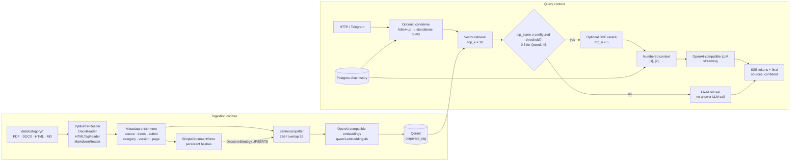

# Корпоративный RAG

## Архитектура



Ingestion и query разделены. FastAPI не переиндексирует корпус во время обычного
запроса. Compose выполняет `scripts/ingest.py data/` перед стартом приложения,
а `POST /documents/upload` запускает тот же pipeline как background task.

## Ingestion

`app/services/ingestion.py` явно выбирает reader по расширению:

- PDF — `PyMuPDFReader` (`pymupdf>=1.24`);
- DOCX — `DocxReader`; author читается из DOCX core properties через
  `python-docx`;
- HTML/Confluence export — `HTMLTagReader(tag="body")`;
- Markdown — `MarkdownReader`.

Для каждого документа добавляются `source`, `file_name`, `file_path`,
`last_modified`, `created_at`, `author` при наличии, первый сегмент
`data/<category>/...` как `category`, версия из имени вида `*-v1.2.*` и `page`.
Технические значения перечислены в `excluded_embed_metadata_keys`, поэтому пути,
даты, номера страниц и служебные HTML-поля не меняют смысл embedding.

Pipeline:

```text
readers → metadata → SentenceSplitter(256, 32) → embedding → Qdrant
                         ↕
              SimpleDocumentStore + UPSERTS
```

`SimpleDocumentStore` сохраняется в `RAG_PIPELINE_STORAGE_DIR`
(`var/ingestion/docstore.json`). Стабильный document id и hash позволяют
`DocstoreStrategy.UPSERTS` удалить старые чанки изменённого документа и не
добавлять ничего для неизменённого. CLI печатает итог
`0 changed, N unchanged`; повреждённый файл получает суффикс `.failed`, а ошибка
остаётся в логе.

Локальный запуск:

```bash
python scripts/download_data.py
python scripts/ingest.py data/ --show-progress
python scripts/ingest.py data/
```

## Retrieval, guard и цитаты

Последовательность в `app/services/rag.py`:

1. При наличии истории и `RAG_CONDENSE_ENABLED=true` короткий follow-up
   переписывается в самостоятельный запрос. В prompt передаётся `chat_id`, но
   отдельное хранилище не создаётся.
2. Retriever получает `RAG_SIMILARITY_TOP_K=10`.
3. До answer-generation считается максимальный cosine score.
4. Если score ниже порога, возвращается
   `по базе не нашёл, могу эскалировать`; генерация ответа не вызывается.
5. При `RAG_RERANKER_ENABLED=true` кандидаты сортирует multilingual
   `BAAI/bge-reranker-v2-m3`, остаётся `top_n=5`. Это optional heavyweight
   dependency из extra `local-embeddings`; без неё сервис пишет warning и
   сохраняет исходный порядок retrieval. При выключенном re-ranker первые
   пять retrieval-кандидатов также передаются в контекст.
6. Фрагменты нумеруются, а системный prompt требует подтверждать утверждения
   ссылками `[1]`, `[2]`. JSON sources использует те же номера.

История Postgres передаётся генерации целиком после существующего token-budget
window. Поэтому «А для них?» понятен генератору; condense нужен только для
качества поиска.

Предметная smoke-пара для `scripts/verify_multiturn.py`:
«Почему в Ansible лучше избегать command и shell?» →
«А как для них обеспечить идемпотентность?». Вторая реплика должна быть
переписана в самостоятельный Ansible-запрос и вернуть источники из
`ansible_best_practices.md`/`ansible_playbook_practices.md`.

## Порог отказа

Кодовый default — `RAG_SCORE_THRESHOLD=0.3`. Это стартовое значение для cosine
на OpenAI `text-embedding-3-small`, указанное в задании. Локальный Compose
использует другую модель, `qwen3-embedding:4b`, поэтому в корневом `.env.example`
зафиксирован откалиброванный порог `0.5`.

Фактический прогон 27 июля 2026 года на полном 56-файловом корпусе:

| Метка | min | median | max |
| --- | ---: | ---: | ---: |
| 5 предметных запросов | 0.644 | 0.702 | 0.770 |
| 5 запросов вне базы | 0.207 | 0.305 | 0.367 |

При `0.3` три negative-запроса проходили guard, поэтому этот порог для Qwen3 4B
не принят. `0.5` лежит между наблюдаемым negative max `0.367` и positive min
`0.644`: запас до каждого класса больше 0.13. Полные вопросы, score и исходное
решение guard лежат в
[`docs/rag_score_distribution.json`](rag_score_distribution.json);
воспроизводящий скрипт — `scripts/calibrate_rag_threshold.py`. При смене корпуса
или embedding-модели распределение нужно пересчитать.

Score-guard дублируется правилом в системном prompt. Кодовая защита экономит
answer-вызов LLM, а prompt защищает от ответа по внешним знаниям при ложноположительном
retrieval.

## API

| Endpoint | Назначение |
| --- | --- |
| `POST /rag/query` | Синхронный одношаговый RAG-ответ |
| `POST /chats` | Создать или получить stateful chat |
| `POST /chats/{id}/messages` | Диалоговый SSE-поток |
| `GET /chats/{id}/messages` | История из JSON/Postgres repository |
| `POST /chats/{id}/messages/{mid}/feedback` | `up/down` и показанные sources |
| `POST /documents/upload` | Сохранить документ и поставить ingestion в background, HTTP 202 |

`POST /rag/query`:

```json
{
  "question": "Почему shell нежелателен в Ansible task?"
}
```

```json
{
  "answer": "Специализированный модуль проще сделать идемпотентным [1].",
  "top_score": 0.737,
  "confident": true,
  "sources": [
    {
      "id": 1,
      "file_name": "ansible_best_practices.md",
      "page": 1,
      "score": 0.737,
      "snippet": "..."
    }
  ]
}
```

SSE каждое событие сериализует через JSON; переводы строк внутри delta остаются
экранированными и не разрывают `data:` frame. Финальное событие:

```text
data: {"type":"done","message_id":"...","confident":true,"sources":[...]}
```

Telegram-клиент читает этот поток, обновляет одно сообщение не чаще раза в
700 мс, после завершения добавляет 👍/👎 и передаёт backend список показанных
sources вместе с feedback.

## Подтверждённая приёмка

Полный локальный прогон выполнен 27 июля 2026 года с Ollama
`qwen3:8b`, `qwen3-embedding:4b`, Qdrant 1.14, PostgreSQL 16 и Redis 7.4:

| Проверка | Фактический результат |
| --- | --- |
| Cold ingestion | `56 changed, 0 unchanged, 0 failed`, 1726 чанков |
| Повторный ingestion | `0 changed, 56 unchanged, 0 failed`, 0 новых чанков |
| Профильный `/rag/query` | top score `0.7598`, `confident=true`, пять sources и цитаты |
| Внебазовый запрос | score `0.2963 < 0.5`, фиксированный отказ и событие `rag.score_guard_refusal` |
| Multi-turn follow-up | condense сохранил Ansible-контекст, top score `0.7631` |
| PDF upload | HTTP 202 за 4 мс, один чанк доступен в поиске примерно через 8 секунд |
| Ошибка reader | повреждённые и повторно загруженные PDF получили уникальные имена `*.failed` |
| Feedback | `up/down` и показанные sources записаны в PostgreSQL |
| Telegram | реальный Bot API polling, backend SSE и финальное редактирование сообщения |
| Compose | обычный `docker compose up -d` поднял app, bot, Qdrant, PostgreSQL и Redis |

После тестового PDF рабочая коллекция содержала 1727 точек. Этот upload хранится
в runtime volume и не входит в репозиторный inventory из 56 файлов.

Автоматические проверки финального состояния: backend — `93 passed, 6 skipped`;
Telegram — `14 passed`. Отдельный Telegram-тест подтверждает схлопывание быстрых
чанков при `MIN_EDIT_INTERVAL=0.7`.

## Запуск

Из корня workspace:

```bash
cp .env.example .env
# заполнить BOT_TOKEN и при необходимости имена локальных Ollama-моделей
docker compose up -d
```

Compose поднимает app, Qdrant, Redis, PostgreSQL и bot. Индексирование, миграции
и запуск API входят в command контейнера app; `docker exec` и ручной `pip
install` не нужны. На первом старте embedding всего корпуса может занять
несколько минут; healthcheck учитывает это через `start_period=5m`.
