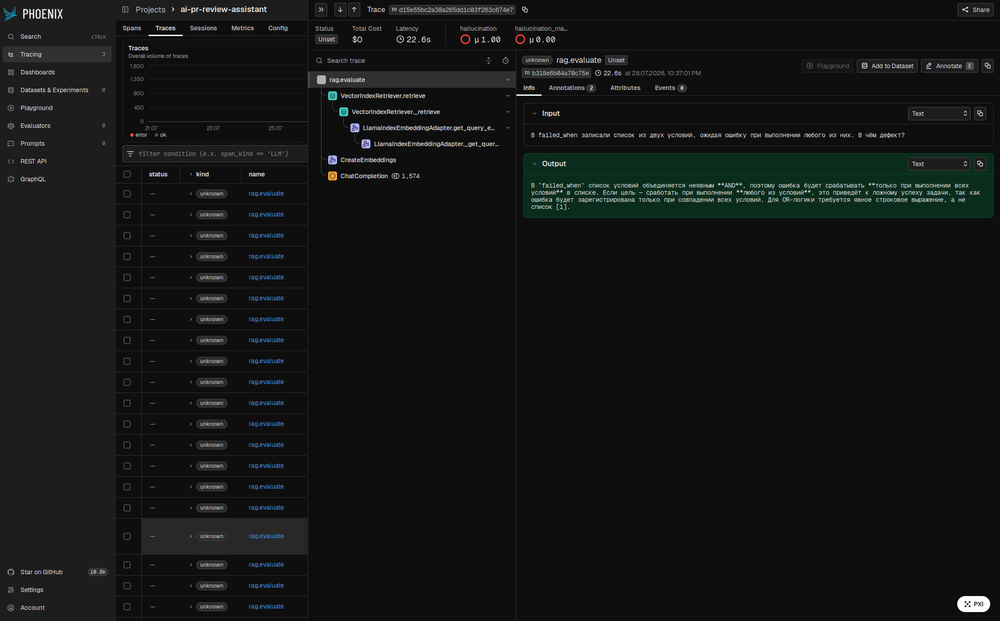
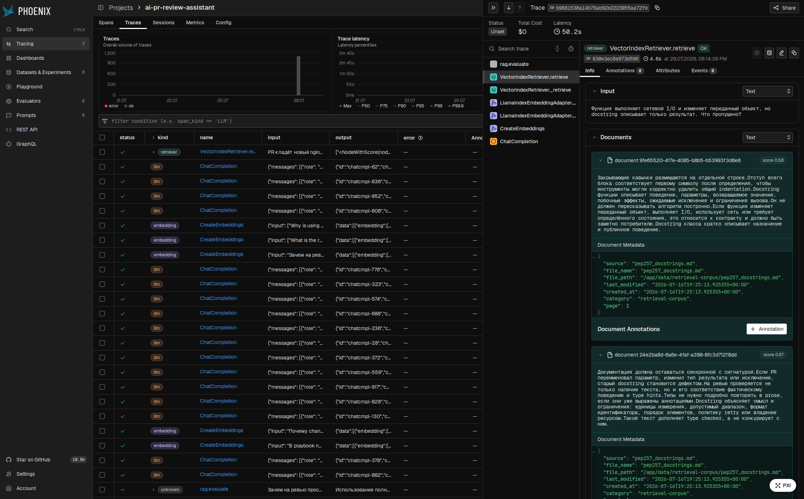

# Оценка качества RAG

Отчёт сгенерирован из timestamped-артефактов в `tests/eval/results/`. Числа ниже
не переписывались вручную.

## 1. Конфигурация

- Production LLM: `qwen3:latest` через локальный Ollama.
- Judge LLM: `qwen2.5:14b` через OpenAI-compatible API Ollama;
  judge отделён от production-модели.
- Judge embeddings: `qwen3-embedding:4b`, размерность 2560.
- Vector store: Qdrant; cosine similarity.
- Chunking: SentenceSplitter, baseline 256/32, эксперимент 512/32.
- Retrieval: top-K 10; re-ranker выключен; в generation передаются top-5.
- Score threshold: 0.300.
- Evaluation: RAGAS 0.4 collections API, `llm_factory`, пять метрик.
- Selection policy: обязательные gates faithfulness > 0.70, answer relevancy >
  0.70, has_citation > 0.95; среди прошедших вариантов максимизируется среднее
  faithfulness и answer relevancy.

Облачных Anthropic/OpenAI ключей в окружении нет, поэтому этот baseline намеренно
получен локальным judge. Его нельзя напрямую сравнивать с будущим прогоном Claude
или OpenAI: при смене judge весь baseline пересчитывается.

## 2. Golden dataset

`tests/eval/golden_dataset.json` содержит 35 уникальных пар с полями
`user_input`, `reference`, `reference_contexts`. Сырой набор создавался
`TestsetGenerator.generate_with_chunks()` по 10 документам из
`data/retrieval-corpus/` и сохраняется в `tests/eval/golden_dataset_raw.csv`.
После генерации вопросы вычитаны вручную: удалены дубли, общие и нелепые вопросы,
а reference и reference_contexts сверены с корпусом и исправлены.

## 3. Baseline

| Вариант | faithfulness | answer_relevancy | context_precision | context_recall | has_citation | avg latency, ms |
|---|---:|---:|---:|---:|---:|---:|
| baseline | 0.777 | 0.810 | 0.929 | 0.981 | 1.000 | 32668.2 |

Артефакт: `2026-07-28_152457_baseline.csv`.

## 4. Эксперимент A — chunking

Меняется только chunk size: 256 → 512. Overlap=32, top-K=10, модели, judge и
golden dataset фиксированы.

| Вариант | faithfulness | answer_relevancy | context_precision | context_recall | has_citation | avg latency, ms |
|---|---:|---:|---:|---:|---:|---:|
| baseline | 0.777 | 0.810 | 0.929 | 0.981 | 1.000 | 32668.2 |
| chunk_512 | 0.767 | 0.792 | 0.959 | 0.989 | 1.000 | 34106.5 |

Беру вариант **baseline** в рамках этого сравнения: среднее faithfulness и answer relevancy 0.794 против 0.779; оба варианта проходят gates.

## 5. Эксперимент B — generation model

Меняется только production LLM: `qwen3:latest` → `qwen3.5:9b` на коллекции с
chunk size 512. Retrieval, judge и golden dataset фиксированы.
Для более медленной локальной модели верхняя граница request timeout поднята до
180 секунд; это operational guard, а не параметр качества RAG.

| Вариант | faithfulness | answer_relevancy | context_precision | context_recall | has_citation | avg latency, ms |
|---|---:|---:|---:|---:|---:|---:|
| chunk_512 | 0.767 | 0.792 | 0.959 | 0.989 | 1.000 | 34106.5 |
| generation_qwen35 | 0.796 | 0.621 | 0.962 | 0.989 | 0.886 | 61355.9 |

Беру вариант **chunk_512**: он проходит обязательные gates, а **generation_qwen35** не проходит (answer_relevancy, has_citation).

## 6. Финальная конфигурация и числа

Беру вариант **baseline**, потому что он проходит обязательные gates, а
среднее двух ключевых метрик faithfulness и answer relevancy максимально среди
трёх прогонов: 0.794. Финальные параметры:
chunk size 256, overlap
32, top-K
10, re-ranker
выключен.

| Вариант | faithfulness | answer_relevancy | context_precision | context_recall | has_citation | avg latency, ms |
|---|---:|---:|---:|---:|---:|---:|
| baseline | 0.777 | 0.810 | 0.929 | 0.981 | 1.000 | 32668.2 |

Порог для справочного/внутреннего сценария зафиксирован как engineering minimum:
faithfulness > 0.70, answer relevancy > 0.70, has_citation > 0.95.

## 7. Failure analysis

Худшие ответы отсортированы по faithfulness по финальному CSV. Диагноз:
низкие faithfulness и context recall — retrieval; низкий faithfulness при
высоком recall — generation.

### 1. PR переименовал параметр публичной функции, но оставил старое имя в docstring. Насколько это серьёзно?

- Retrieved contexts: Документация должна оставаться синхронной с сигнатурой.Если PR переименовал параметр, изменил тип результата или исключение, старый docstring становится дефектом.На ревью проверяется не только наличие текста, но и его соответствие фактическ / PEP 257: соглашения для docstring Источник: https://peps.python.org/pep-0257/ Docstring — строковый литерал, который является первым выражением модуля, функции, класса или метода и доступен через `__doc__`.Обычный комментарий рядом с опреде / Публичные и внутренние интерфейсы должны быть различимы.Публичный API требует совместимости и документации; внутренние детали можно обозначить underscore и исключить из `__all__`.Рефакторинг не должен случайно экспортировать вспомогательный
- Response: Это серьёзная ошибка, так как docstring не синхронизирован с обновлённой сигнатурой функции. Старое имя параметра в docstring становится дефектом, особенно для публичного API, где документация должна точно отражать поведение и сигнатуру [1]. Такие несоответствия могут вызвать путаницу у пользователей и нарушить обратную совместимость [4]. Нужно исправить docstring до выпуска изменений.
- Метрики: faithfulness=0.333,
  answer_relevancy=0.725,
  context_precision=0.804,
  context_recall=1.000,
  has_citation=1.000.
- Диагноз: generation-проблема: контекст достаточен, но ответ ему не следует.

### 2. Как аннотировать async def load(), если после await она возвращает User?

- Retrieved contexts: PEP 484: ревью аннотаций типов Источник: https://peps.python.org/pep-0484/ PEP 484 определяет стандартную семантику type hints.Аннотации предназначены прежде всего для статического анализа, IDE и понимания контрактов; Python runtime сам по  / Не следует скрывать сложный callback под `Callable[..., Any]`, если библиотека реально зависит от формы вызова.Аннотации экземпляров и class variables должны различаться. `ClassVar` сообщает анализатору, что поле принадлежит классу и не явл / Явный `Coroutine` нужен, когда обычная функция действительно возвращает coroutine object. `Optional[T]` означает `T | None`, а не «аргумент можно не передавать».Параметр с default имеет право отсутствовать при вызове независимо от того, доп
- Response: Аннотация возвращаемого значения `async def load()` должна указывать тип объекта, который возвращается после `await`, а не тип coroutine. Правильный синтаксис: `async def load() -> User`. Это означает, что после ожидания функция вернёт объект типа `User`, а в runtime вызывающая сторона получит coroutine, который будет выполнен и вернуть этот объект [1].
- Метрики: faithfulness=0.400,
  answer_relevancy=0.828,
  context_precision=1.000,
  context_recall=1.000,
  has_citation=1.000.
- Диагноз: generation-проблема: контекст достаточен, но ответ ему не следует.

### 3. Template с паролем запускают в CI с --diff. Что нужно изменить?

- Retrieved contexts: Для template с secrets используется `diff: false`, даже если файл защищён permissions.Оператор ограничивает запуск одним host или узкой группой, поскольку большой diff создаёт шум и повышает риск утечки в CI logs.На ревью проверяется поддер / Условие должно быть обосновано.Простое исключение всех сложных tasks делает dry run зелёным, но бесполезным; лучше улучшить поддержку check mode или явно документировать ограничение.Diff mode показывает before/after для модулей, которые его / Команда расшифрования должна однозначно выбирать identity.Один общий пароль для всех окружений увеличивает blast radius компрометации. `no_log: true` предотвращает обычный вывод аргументов и результата task, содержащих secret, но снижает на
- Response: Для template с паролем, запускаемого в CI с `--diff`, необходимо отключить режим diff, установив `diff: false` для данного template. Это предотвратит запись чувствительных данных в CI logs, так как diff mode может вывести содержимое секретного файла. Упомянуто в фрагментах [1] и [2]. Дополнительно рекомендуется задавать ограниченные permissions (owner, group, mode) для файла с секретом, как указано в [3].
- Метрики: faithfulness=0.500,
  answer_relevancy=0.802,
  context_precision=0.950,
  context_recall=1.000,
  has_citation=1.000.
- Диагноз: generation-проблема: контекст достаточен, но ответ ему не следует.

### 4. В playbook пользователя создают через shell: useradd. Как исправить задачу?

- Retrieved contexts: Удаление файлов, изменение firewall, миграция данных и рестарт сервиса требуют особого внимания к scope.Task должен ограничивать target, иметь понятный condition и не зависеть от случайного порядка host iteration.Для опасной операции полезн / Ansible playbooks: идемпотентность и структура задач Источники: - https://docs.ansible.com/projects/ansible/latest/playbook_guide/playbooks_intro.html - https://docs.ansible.com/projects/lint/rules/no-changed-when/ Playbook описывает желаем / Принцип least privilege требует минимального времени и набора операций под escalation.Remote user и become user могут быть непривилегированными.В этом случае Ansible должен безопасно передать временный module file между пользователями; особ
- Response: В playbook вместо использования `useradd` через `shell` рекомендуется использовать специализированный модуль Ansible `ansible.builtin.user` для создания пользователя. Это обеспечит идемпотентность и корректное поведение при повторном запуске [2]. Если создание пользователя требует `sudo`, укажите `become: yes` только для этой задачи, а не для всего play, чтобы ограничить привилегии [4]. Также проверяйте существование пользователя перед созданием, чтобы избежать ошибок [1].
- Метрики: faithfulness=0.500,
  answer_relevancy=0.791,
  context_precision=0.639,
  context_recall=1.000,
  has_citation=1.000.
- Диагноз: generation-проблема: контекст достаточен, но ответ ему не следует.

### 5. Для неизвестного значения поставили Any, хотя до type guard с ним нельзя выполнять операции. Какой тип безопаснее?

- Retrieved contexts: Он допустим на границе нетипизированной библиотеки, динамического JSON или во время ограниченной миграции, но причина должна быть локальной и понятной.Для произвольного значения, которое нельзя использовать без narrowing, безопаснее `object / Type alias даёт имя сложной, повторяющейся форме данных и фиксирует её смысл.Однако alias для `dict[str, Any]` не описывает обязательные ключи.Для устойчивой JSON-подобной структуры следует рассмотреть `TypedDict`, dataclass или модель вали / Ревьюер проверяет целевую версию Python и не предлагает синтаксис, несовместимый с ней.Импорты только для типов можно помещать под `TYPE_CHECKING`, если runtime import создаёт цикл или дорогой side effect. `cast()` не преобразует значение в
- Response: Для неизвестного значения, с которым нельзя выполнять операции до type guard, безопаснее использовать `object` вместо `Any`. Это позволяет сохранить типизацию и избежать отключения статической проверки, как указано в [1].
- Метрики: faithfulness=0.500,
  answer_relevancy=0.823,
  context_precision=0.700,
  context_recall=1.000,
  has_citation=1.000.
- Диагноз: generation-проблема: контекст достаточен, но ответ ему не следует.


## 8. Известные проблемы и план улучшений

- Три обязательных целевых порога достигнуты.

- RAGAS — LLM-as-judge, поэтому ожидается шум порядка 5–10%; выводы делаются
  только на фиксированных 35 вопросах и одном judge.
- Следующий шаг: проверить low-recall случаи с semantic chunking и отдельным
  re-ranker экспериментом, затем полностью пересчитать baseline.
- Phoenix используется для диагностики: retriever spans показывают чанки и
  similarity scores, LLM spans — prompt, response и token usage.
- Post-factum Phoenix HallucinationEvaluator: 4.3% hallucinated на 23 live-трейсах (`2026-07-28_180237_hallucination_live.csv`).
- Ручная проверка положительных verdict: 0/23 подтверждённых галлюцинаций, 1 false positive evaluator.





## Воспроизведение

```bash
docker compose up -d qdrant phoenix
docker compose --profile eval run --rm eval python scripts/verify_eval.py
docker compose --profile eval run --rm eval python scripts/prepare_eval_collections.py
docker compose --profile eval run --rm eval python scripts/run_ab_evals.py
docker compose --profile eval run --rm eval python scripts/build_eval_report.py
```

Judge cache хранится в `tests/eval/.ragas_cache/`; для полностью независимого
повторного judge-прогона передайте `--no-cache`.
